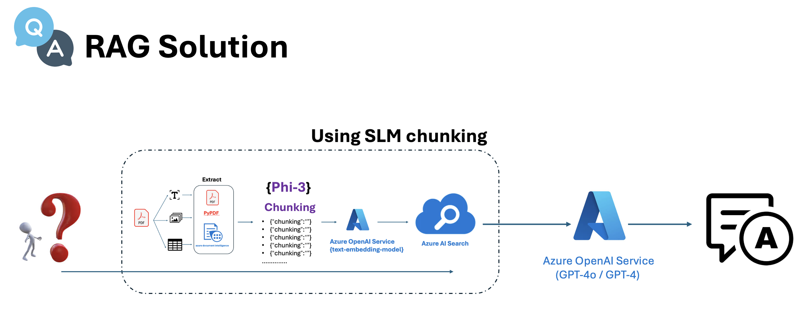
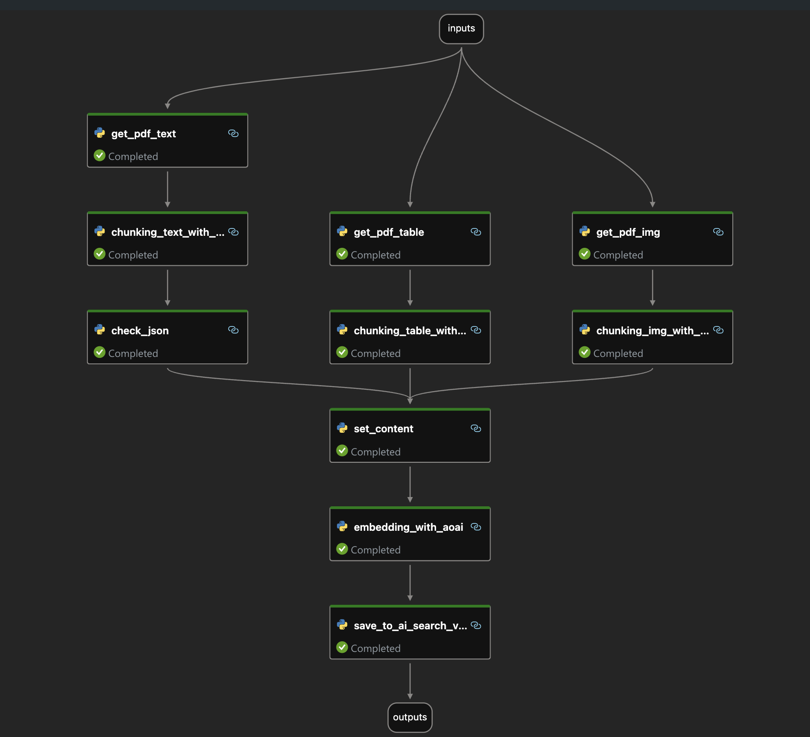

# **Using SLM(Phi-3) Chunking PDF Documents**

This project focuses on implementing and exploring  Chunking techniques. It's designed to enhance the efficiency and accuracy of data processing and retrieval in various applications.
 
Key Features

- Chunking: Learn how to segment and process large datasets using advanced chunking methods.
- Integration with Phi-3: Utilize SLMs to enhance data processing capabilities.
- Practical Examples: Follow detailed examples and use cases to understand the application of SLM chunking in real-world scenarios.
 
Getting Started

To get started, you'll need:
- Basic knowledge of Python and data processing.
- Access to Azure services for implementing AI-driven solutions.
 
Highlights

- Comprehensive Documentation: Detailed notebook guides and documentation to help you understand and implement chunking.
 
Under the architecture model add the following
 
Retriever-Reader Architecture for Open-domain question answering (RAG Solution).
 
Here's a breakdown of the process depicted:
 
1. Question Input: The process starts with a question, represented by a magnifying glass and a question mark.
 
2. Extract: This stage involves extracting relevant information from various sources, such as documents, the web, and text snippets.
 
3. Chunking (Phi-3): The extracted data is processed and segmented using a method called SLM chunking. This stage is represented by overlapping circles with mathematical symbols, indicating data processing.
 
4. Azure AI Service: The processed data is then fed into an AI service provided by Azure, specifically using , to generate answers.

### **Steps**

1. Extract information including text, images and tables from the pdf document. PyPDF is used for text and images, and Azure Document Intelligence is used for tables

2. Slice the extracted text/table through Phi-3/Phi-3.5 Instruct. Of course, Prompt is very important. It is necessary to keep the context coherence and keep the original text as much as possible.

    ***Samples***

   - Chunking Text : [Click here](./prototype/01.chunking_text.ipynb)

   - Chunking Table : [Click here](./prototype/03.chunking_table.ipynb)

3. Understand the extracted images through Phi-3/Phi-3.5 Vision

    ***Samples***

   - Chunking Image : [Click here](./prototype/03.chunking_imgs.ipynb)

4. Reorganize and merge the text, images and tables to complete the real chunking

5. Complete quantization through the Azure OpenAI Service text-ada-embedding model and save it to AI Service.

**This is SLM Trunking flow diagram**

***Samples***

   - SLM Chunking FLow : [Click here](./code/slm-chunking-flow/)
  
   - SLM Chunking Chat : [Click here](./code/slm-chunking-chat/)

