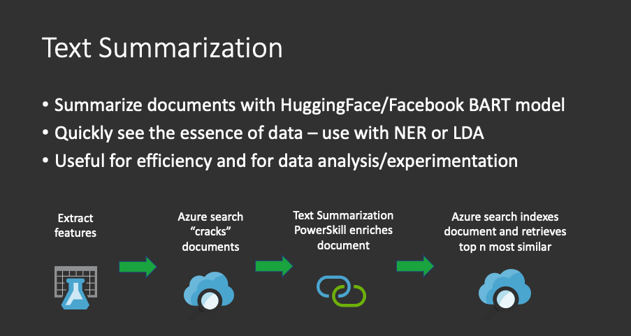

# Text Summarization Power Skill #

This Power Skill uses the pre-trained [HuggingFace/Facebook BART model](https://huggingface.co/facebook/bart-large-cnn)
deep learning model to generate a summary for an input text - English only.

This skill is ideal for:

1) Exploring your data to summarize and categorise your documents in the data exploration phase
2) Using in conjunction with Azure Text Analytics or a Named Entity Recognition (NER) model and Latent Dirichlet 
Allocation (LDA) topic modelling to further identify areas of interest

This example uses the
[Meantime News dataset](http://www.newsreader-project.eu/results/data/wikinews/), and some sample texts have been placed in the [data](data/) folder.

This Power Skill includes a [Visual Studio Code dev container](https://code.visualstudio.com/docs/remote/containers). If you use the dev container then your development environment will be set up with all the required dependencies:

- python 3
- jupyter notebooks
- tensorflow
- Terraform
- Docker client
- Azure CLI

## Requirements

In addition to the common requirements described in the root [README.md](https://github.com/Azure-Samples/azure-search-power-skills/blob/master/README.md) 
file, this Power Skill requires access to a Text Analytics resource. This process will use NER to illustrate 
the entities extracted and its relevance to the summarized text.

This PowerSkill will use:
* Docker
* Azure Container Registry
* Azure Blob storage container
* Azure Web App Service - Linux Containers
* Azure Cognitive Search (ACS) instance
* Azure Cognitive Services

## High level Process



## Quick deployment
In order to deploy everything, you can simply use bash and type
```bash
make deploy
```
and type 'yes' when prompted. You can test your deployment by using this [Notebook](notebooks/Azure.ipynb)

## Run locally

This section describes how to get the sample working in stages and how it can be amended for your data.
 
1) ### Data
   The first step is to view the sample data files [here](data/). 
1) ### Run the API locally
   The next step is to run the API locally and test the model against a test record. Make sure you rename the file [.env.example file to .env](../powerskill/.env.example) and populate it with the relevant values, particularly a unique key. Again use a bash terminal.
   ```bash
   make local-API
   ```
   NB: the [HuggingFace/Facebook BART model](https://huggingface.co/facebook/bart-large-cnn) is 1.6Gb, this will be downloaded and then cached. It may take some time to start the application.

    Upon starting you will see the download of the BART model initiate. See below for example:
    
    ```bash
    DEBUG:urllib3.connectionpool:https://cdn-lfs.huggingface.co:443 "GET /facebook/bart-large-cnn/2ac2745c02ac987d82c78a14b426de58d5e4178ae8039ba1c6881eccff3e82f1 HTTP/1.1" 200 1625270765
    Downloading:   1%                      
    ```
    You should see the following when it is ready:
    
    ```bash
    INFO:uvicorn.error:Uvicorn running on http://0.0.0.0:5000 (Press CTRL+C to quit)
    ```

   You can test your local API two different ways:
    - Jupyter Notebook [Test summarization on our local running API](notebooks/1_TestLocally.ipynb).
    - RestClient [local-API.http](docs/local-api.http)

1) ### Build the docker image 
   Now we can containerise the application by building and running a [docker image](powerskill/Dockerfile) and test our inference API locally.

   NB: Ensure you stop the python application from the previous step otherwise you will have port clashes. Again in bash, run
   ```bash
   make run-skill
   ```
   
   Note, the [HuggingFace/Facebook BART model](https://huggingface.co/facebook/bart-large-cnn) is 1.6Gb. If you have ran the previous step, hopefully it will not have to download the model again. It can still take a minute to load the 1.6Gb into memory though.
    
   Again, you can test your local API hosted in docker two different ways:
    - Jupyter Notebook [Test summarization on our local running API](notebooks/1_TestLocally.ipynb).
    - RestClient [local-API.http](docs/local-api.http)

## Run in Azure
  In order to deploy this into Azure, we need some to build some shared infrastructure - you may already have this from another PowerSkill. If you do, you can simply rename [base.env.example](base.env.example) to be `base.env` and fill in the values.

  1) ### Deploy shared infrastructure
      If not, you can deploy the foundation simple by running the following in bash
      ```bash
      make deploy-base
      ```
      At this point, Terraform has now created the following infrastructure and created a `base.env` file with the values.
      - Azure Container Registry to store our docker image
      - Azure Cognitive Services to enrich the data
      - Azure Cognitive Search
      - Azure Blob Storage to hold our data to seach

  1) ### Push the container to Azure Container Registry
      We can now push our container that we built earlier to the cloud. Type the following command in your bash terminal.
      ```bash
      make push-skill
      ```


  1) ### Deploy the container to an Azure Web App.
      We will deploy this as to an [Azure App Service Web App](https://docs.microsoft.com/en-us/azure/app-service/configure-custom-container?pivots=container-linux) running a container. Run the following command:
      ```bash
      make deploy-skill
      ```
      You will be prompted with:
      ```bash
      Do you want to perform these actions?
        Terraform will perform the actions described above.
        Only 'yes' will be accepted to approve.
      ```
      Type 
      ```bash
      yes
      ```
  1) ### Test the index
      Now we are in a position to search on our most similar data, navigate to the [Let's go and test the ACS index](notebooks/2_Azure.ipynb) to summarise our text and also run NER.
