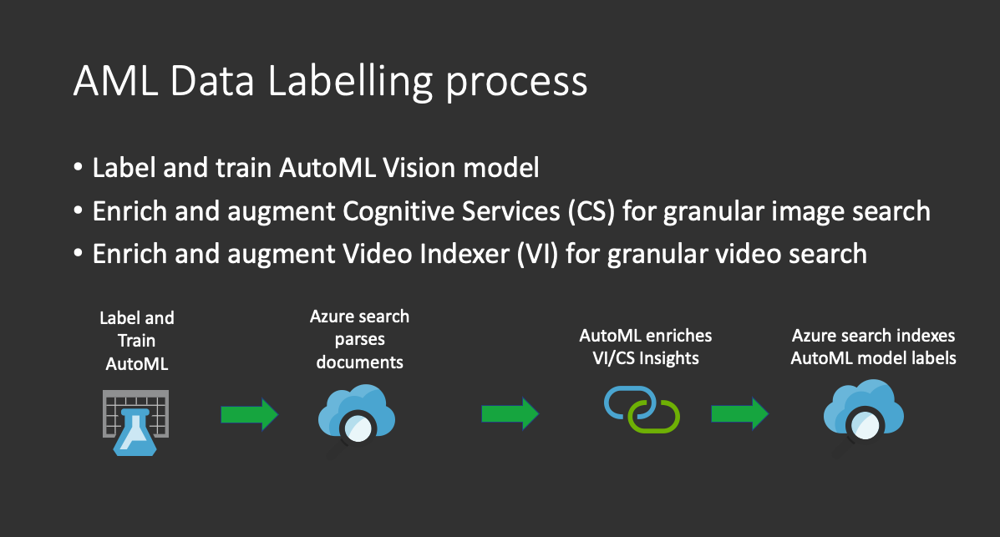

# AutoML Vision Classifier Power Skill

This Power Skill uses the AutoML trained vision model output from the [Azure Machine Learning Data Labelling project](https://docs.microsoft.com/en-us/azure/machine-learning/how-to-create-labeling-projects)

The Data Labelling functionality of AML is an AutoML process that, if the project is running, will automatically select
a model architecture, split your datasets and train your model. If you further label more data, the model will be re-
trained and the best performing model will be published. This PowerSkill has a parameter, namely `GET_LATEST_MODEL` that
will connect to your AML workspace at startup to see whether a better performing model is available, and if there is,
will download it and use it for inference.

This skill is ideal for:

1) Exploring your data to quickly classify images during your data exploration phase
1) Using in conjunction with Custom Vision Classification to further classify and extract insights from your data
1) Working with video where individual keyframes are extracted for analysis
1) Creating an interactive vision ML project where are you label and train more models, the PowerSkill downloads
your latest and best model automatically for inference

## Requirements

In addition to the common requirements described in the root README.md file, this Power Skill requires access to an AML
Workspace and data labelling project. This PowerSkill will download your latest model from a running AML
data labelling project, which means you can test changes quickly with an interactive pipeline.

To run this PowerSkill you will need:

* docker
* An Azure Blob storage container
* A provisioned Azure Cognitive Search (ACS) instance
* A provisioned Azure Container Registry
* A Cognitive Services key in the region you deploy ACS to
* An AML Workspace with a [Data Labelling](https://docs.microsoft.com/en-us/azure/machine-learning/tutorial-labeling)
project running

Below is a full working example that you can get working end to end on sample data.

## High Level Process



## How to implement

### Data

The sample model deployed with this solution has been trained on the [Stanford dogs dataset](http://vision.stanford.edu/aditya86/ImageNetDogs/). A trained model is deployed with the pre-built container and has been trained on the following dog breeds:

* Airedale
* Doberman
* Rottweiler
* Afghan
* African Wild Dog

If you want to run the sample model, extract the data in the [dogs.zip](data/dogs.zip), we will need to upload this to a blob container as this will be the data source that we will use to run the Azure Cognitive Search Indexer on.

### Docker container

If you want to use a prebuilt image with the dogs model and push it to your container registry you can run:

```bash
docker pull shanepeckham/amlclassifier_powerskill:v1
docker tag shanepeckham/amlclassifier_powerskill:v1 [yourcontainerregistry].azurecr.io/amlclassifier:v1
docker push yourcontainerregistry].azurecr.io/amlclassifier:v1
```

By default the Azure Web App will pull the pre-built image from:

```bash
shanepeckham/amlclassifier_powerskill:v1
```

*Note DockerHub applies rate limits so the image needs to be re-tagged or rebuilt and pushed to your container
registry. See the [following link for more detail](https://docs.docker.com/docker-hub/download-rate-limit/)*

Run the following command to build the inference API container image:

```bash
docker build -t [container_registry_name.azurecr.io/vision_classifier:[your_tag] .  
```

Note, the prebuilt model only exists in the docker image `shanepeckham/amlclassifier_powerskill:v1` so if you need
the prebuilt model, first pull this image and then retag it.

The container will require the following variables set at runtime:

```bash
KEY=[YourSecretKeyCanBeAnything]    # This is a secret key - only requests with this key will be allowed
DEBUG=True   # This enables verbose logging
AZUREML_MODEL_DIR=models  # This is the model directory
EXPERIMENT_NAME=labeling_Training_xxxxxxx  # This is AML AutoML Vision experiment
GET_LATEST_MODEL=True # Get the latest model from AML if True
WEBSITES_PORT=5000
```

You will also need to populate the [config.json](config.json) so that the PowerSkill can connect to the AML Data
Labelling project to download the latest model. You will need to have a [Service Principal set up to allow
non-interactive authentication](https://docs.microsoft.com/en-us/azure/machine-learning/how-to-setup-authentication#use-service-principal-authentication) to your AML workspace.

```bash
{
    "subscription_id": "",  # Azure subscription Id
    "resource_group": "",   # The AML resource group
    "workspace_name": "",   # The AML Workspace name
    "tenant_id": "",        # Your AD tenant Id
    "service_principal_id" : "",  # Client Id
    "service_principal_password": ""  # Client Secret
}
```

### Run the API locally

See the file [sample_env](custom-skills-deployment/sample_env) for the .env format

Now we can test the container by running it locally with our variables:

```bash
docker run -it --rm -p 5000:5000 -e DEBUG=true -e KEY=YourSecretKeyCanBeAnything 
-e AZUREML_MODEL_DIR=models  -e GET_LATEST_MODEL=True 
-e EXPERIMENT_NAME=labeling_Training_xxxxxxxx 
[container_registry_name.azurecr.io/vision_classifier:[your_tag]
```

Upon container startup you will see a few messages, these can be ignored. See below:

```bash
Failure while loading azureml_run_type_providers. Failed to load entrypoint automl = azureml.train.automl.run:AutoMLRun._from_run_dto with exception cannot import name 'RunType' from 'azureml.automl.core._run.types' (/usr/local/lib/python3.7/site-packages/azureml/automl/core/_run/types.py).
/usr/local/lib/python3.7/site-packages/torch/cuda/__init__.py:52: UserWarning: CUDA initialization: Found no NVIDIA driver on your system. Please check that you have an NVIDIA GPU and installed a driver from http://www.nvidia.com/Download/index.aspx (Triggered internally at  /pytorch/c10/cuda/CUDAFunctions.cpp:100.)
```

At the time of writing it is not clear why the entrypoint error occurs, once the model has fully loaded though inference
works as expected and the error does not appear again. The CUDA error pertains GPU inference which is not required for
this PowerSkill.

You should also see the following, indicating that the server is up and running and ready to receive requests in port
5000:

```bash
INFO:uvicorn.error:Uvicorn running on http://0.0.0.0:5000 (Press CTRL+C to quit)
```

### Deploy the container to an Azure Web App

We will deploy this as an [Azure App Service Web App](https://docs.microsoft.com/en-us/azure/app-service/configure-custom-container?pivots=container-linux).
running a container.

First, if you have built your own container image we need to push it to the container registry.

Run the following command:

```bash
docker push [container_registry_name].azurecr.io/vision_classifier:[your_tag]
```

In the [deployment folder](deployment/webapp) are two [terraform](https://www.terraform.io/)
files to deploy the inference API to an App Service Web App for linux.

The simplest is to open a cloud [cloud shell](https://shell.azure.com/) and upload
the [main](deployment/webapp/main.tf) and [variables](deployment/webapp/variables.tf)
to your cloud shell storage as this avoids the need for any installation.

Set the following values in the [variables](deployment/webapp/variables.tf)
file:

```bash
    variable "app_service_sku" {
  description = "The SKU (size - cpu/mem) of the app plan hosting the container. See: https://azure.microsoft.com/en-us/pricing/details/app-service/linux/"
  default = "P2V2"
}

variable "docker_registry_url" {
  description = "[your container registry].azurecr.io"
  default = ""
}

variable "docker_registry_username" {
  description = "[your container registry username]"
  default = ""
}

variable "docker_registry_password" {
  description = "[your container registry password]"
  default = ""
}

variable "docker_image" {
  description = "[your docker image name]:[your tag]"
  default     = "shanepeckham/amlclassifier_powerskill:v1"
}

variable "resource_group" {
  description = "This is the name of an existing resource group to deploy to"
  default = ""
}

variable "location" {
  description = "This is the region of an existing resource group you want to deploy to"
  default = "eastus2"
}

variable "debug" {
  description = "API logging - set to True for verbose logging"
  default = false
}

variable "azureml_model_dir" {
  description = "The model directory where the AML model resides"
  default = "models"
}

variable "get_latest_model" {
  description = "If true, downloads the latest model from AML"
  default = True
}

variable "experiment_name" {
  description = "The training experiment associated with the AML Labelling project"
  default = labeling_Training_96eaa765
}
```

Navigate to the directory containing the files and enter:

```bash
terraform init
```

Then enter:

```bash
terraform apply
```

You will be prompted with:

```bash
Do you want to perform these actions?
  Terraform will perform the actions described above.
  Only 'yes' will be accepted to approve.
```

Type

```bash
 yes
```

Once deployed, copy the Azure Web App URL which may be found in the overview section of the portal as we will need it to plug into Azure Search.

## Test the API and deploy the datasource, index, skillset and indexer

### Testing the API

Run the cell [Test our dogs on our API](notebooks/AML%20Classifier.ipynb#Test-our-dogs-on-our-API), this will run
a test against the API using a base64 encoded image string [rottweiler.txt](data/test/rottweiler.txt).

### Data source

Populate the following values and run the [Create the data source](notebooks/AML%20Classifier.ipynb#Create-the-data-source) cell:

```bash
ACS_KEY = ""   # Your ACS API Key
ACS_URL = "https://[your search name].search.windows.net"   # Your ACS URL format https://[your ACS instance].search.windows.net
DATA_SOURCE = "aml-classifier-datasource"  # The name for your data source
CONTAINER_NAME = "dogs"   # The name of your blob container where the images are
BLOB_CONNECTION_STRING = ""   # This is your azure blob connection string

```

### Index

Run the cell [Create the index](notebooks/AML%20Classifier.ipynb#Now-we-create-the-index)

### Skillset

We will create two skillsets, one is the Custom Vision Cognitive Services service which will extract captions and
run object detection, the other is our AML Classifier PowerSkill.

Populate the following value and run the [Now we create the skill sets](notebooks/AML%20Classifier.ipynb#Now-we-create-the-skill-sets)

```bash
COGSVC_KEY = ""  #  This is your Cognitive Services key that resides in the same region as ACS (used to compare custom vision captions and object detection)
```

Note, you need an already deployed ACS instance in the same region as your cognitive services instance as we want to augment what we can extract using custom vision with our similarity model.

### Indexer

Run the cell [Now we create the indexer](notebooks/AML%20Classifier.ipynb#Now-we-create-the-indexer)

The indexer will automatically run and you should see requests coming in if you look at the Web App logs.

### Test the index

Investigate your indexed data, check the labels returned. Run the cell [Let's go and test the ACS index](http://localhost:8891/notebooks/AML%20Classifier.ipynb#Let's-go-and-test-the-ACS-index)

Now we are in a position to search on our custom model labelled images.
