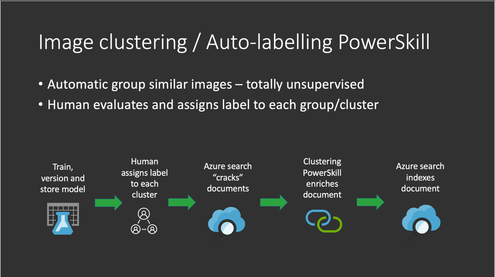

# Image Clustering Power Skill

This Power Skill uses the [DBSCAN](https://scikit-learn.org/stable/modules/generated/sklearn.cluster.dbscan.html)
unsupervised clustering algorithm alongside [VGG16](https://keras.io/api/applications/vgg/) to extract
visual features and cluster images. 

This skill is ideal for:

1) Exploring your data to identify clusters based on visual features during your data exploration phase
2) Using in conjunction with Custom Vision Classification to further cluster your images, for example if
you need a hierarchical classification structure.
3) Auto-labelling your images based on the clusters identified and the labels you associated with the clusters. Note
Azure Machine Learning has an auto-labelling feature already, this Power Skill should be used if this feature is not suitable

See the data folder for sample images used for in the skill.

This Power Skill includes a [Visual Studio Code dev container](https://code.visualstudio.com/docs/remote/containers). If you use the dev container then your development environment will be set up with all the required dependencies:

- python 3
- jupyter notebooks
- tensorflow
- Terraform
- Docker client
- Azure CLI

## Requirements

In addition to the common requirements described in the root [README.md](https://github.com/Azure-Samples/azure-search-power-skills/blob/master/README.md) 
file, this Power Skill requires access to a Custom Vision resource. This process will use object detection and augment 
it with cluster labels.

To run this PowerSkill you will need:
* docker
* An Azure Blob storage container
* A provisioned Azure AI Search instance 
* A provisioned Azure Container Registry
* A AI Services key in the region you deploy AI Search to

Below is a full working example that you can get working end
to end on sample data.

## High level Process


 
1. The first step in the process is to extract [VGG16](https://www.tensorflow.org/api_docs/python/tf/keras/applications/VGG16) embeddings from the images and train the [DBSCAN](https://scikit-learn.org/stable/modules/generated/sklearn.cluster.DBSCAN.html) model on the extracted features.  
   * To better understand the algorithm itself, please use [1-detect-similar-images notebook](notebooks/1-detect-similar-images.ipynb), it contains a local example of the process.
1. Training:
   For simple local training use the local training cell in [2-local-training notebook](notebooks/2-local-training.ipynb)
1. As with any (especially, unsupervised) machine learning solution, inspecting the clusters generated and playing with the algorithm hyperparameters will be required.
   * To explore generated clusters and generate labels dictionary required for the custom skill, you can use [3-create-label-file notebook](notebooks/3-create-label-file.ipynb). These labels are what will be indexed to retrieve the images.
   * Clusters report is also available under the registered model on the Azure Machine Learning Portal.  
1. Build the skill as a container, deploy to Azure Web Apps and configure an Azure AI Search indexer to use it - see [Deploying the solution](#deploying-the-solution)
1. Investigate your indexed data using [Azure Search notebook](notebooks/5-test-search-index.ipynb).

## How to implement

This section describes how to get this working on sample data and how it can be amended for your data.

### Understanding the dataset and running clustering

The first step is to extract the sample data files here [train data](data/train.zip) and the
[test data](data/test.zip) into the existing data folder. 

Open the notebook [Detect Similar Images notebook](notebooks/1-detect-similar-images.ipynb)

This notebooks demonstrates the idea behind the ImageClusteringSkill using a small dataset of open and closed books and
bookshelves.
 
Basically, the PowerSkill consists of the following two steps:

* Extract VGG16 embeddings
* Cluster embeddings using DBSCAN

Run all the cells on the sample dataset to get an idea of how data is clustered.
The notebook will load sample book data from the [train folder](../data/train)
When using on your own data, experiment with the epsilon (eps) parameter as this
will influence the number of clusters detected in the data. Visually inspect it
until it makes sense.

A pre-trained VGG16 model (vgg16_weights_tf_dim_ordering_tf_kernels_notop.h5) will be used
to extract the features from the images.

The last cells display the data that have been clustered as similar.

### Training the model on the data

Open the notebook [Training the model notebook](notebooks/2-local-training.ipynb)

This notebook shows how the model can be trained on the sample data for inference.

Run the cell, "Local Training". Here the parameters for the DBSCAN
algorithm can be experimented with if running on your own data. If running on the book
sample data, leave them as is. Go here for more info on [DBSCAN](https://scikit-learn.org/stable/modules/generated/sklearn.cluster.DBSCAN.html)

Once complete this will save a model to the [models directory](../models). Note, we will be
deploying this model later to our API for inference.

### Labelling our clusters

Now that we have identified the clusters in our data, we want to go and label them with our 
search terms that will help users easily find them. In our sample data, we have books that 
are open and closed and we also have bookshelves. 

Now open the notebook [labelling notebook](notebooks/3-create-label-file.ipynb),
here you will see we labelled the books with a dictionary that allows multiple labels per cluster:

This cell will train a model on the data and show the clusters. All data with a cluster with value -1 could not be 
clustered, all other numbers represent the cluster id.

```python
dict = {0 : ['book cover', 'closed book'], 1 : ['open book', 'double spread'], 2: ['book shelf', 'library']}
```
Here the key of the dictionary relates to the cluster id discovered. Double check the labels
to ensure they match the cluster images, in case they have changed.

We will deploy our generated label file with our docker image.

#### Building and testing the cluster inference API locally

For this step you will need docker running so that we can build and test our inference API locally.
You will also need a container registry for the build.

Run the following command to build the inference API container image and run it:

```bash
make run-skill
```

After the image has built, you should see the following:

```bash
INFO:     Uvicorn running on http://0.0.0.0:5000 (Press CTRL+C to quit)
```

We are now ready to send a request. 

Open `docs/local-api.http` and click "Send Request" above the `POST` request.

After issuing the request you should get the following response:

```json
{
    "values": [
        {
            "recordId": "0",
            "errors": "",
            "data": {
                "label": [
                    "open book",
                    "double spread"
                ]
            },
            "warnings": ""
        }
    ]
}
```


> Alternatively you can also use Postman, see below:
>
> Use [Postman](https://www.postman.com/) to issue a test request to your local inference API.
> As we are emulating what Azure AI Search will send to a PowerSkill, we need to base64
> encode an image as a string.
> 
> Issue the request with the following include the contents of the file
> [postman_request.json](data/postman_request.json) as the body:
> 
>```bash
>URI: http://0.0.0.0:5000/api/extraction
>Headers:
>    Ocp-Apim-Subscription-Key: [YourSecretKeyCanBeAnything]
>    Content-Type: application/json
>Body: Copy the contents of the file ../data/postman_request.json
>```


### Deploying the solution

To deploy the solution, this folder contains [Terraform scripts](deployment) that will provision all the components needed.

1. Copy the `deploy.env-example` file to `deploy.env` and update based on where you want the resources to be deployed
2. Run `make deploy`. This will deploy Azure Search, Azure Storage (for uploading the images), Azure Container Registry (for the docker image of the skill) and Azure Web Apps (for hosting the skill API). If you prefer to use existing resources then create `notebooks/.env` using the example file in the same folder.


### Testing the search labels in Azure AI Search

Now we are in a position to search on our cluster labelled data, open the [5-test-search-index notebook](notebooks/5-test-search-index.ipynb)
to search on our clustered images.
