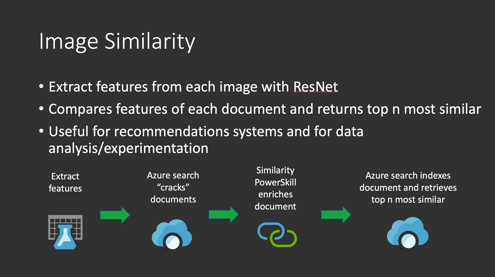

# Image Similarity Power Skill #

This Power Skill uses the pre-trained [ResNet](https://keras.io/api/applications/resnet/)
deep learning model to extract visual features from an image and to find the top n most similar
images. 

This skill is ideal for:

1) Exploring your data to identify similar images during your data exploration phase
2) Using in conjunction with Custom Vision Classification to further classify your data.
3) For use in recommender type systems where similar images are of interest 
4) Working with video where individual keyframes are extracted for analysis

See the data folder for sample images used for in the skill. This uses the [Stanford Dogs dataset](http://vision.stanford.edu/aditya86/ImageNetDogs/)

## Requirements

In addition to the common requirements described in the root [README.md](https://github.com/Azure-Samples/azure-search-power-skills/blob/master/README.md) 
file, this Power Skill requires access to a Custom Vision resource. This process will use object detection to illustrate 
the captions and text extracted and its relevance to the topn similar images.

To run this PowerSkill you will need:
* docker
* An Azure Blob storage container
* A provisioned Azure Cognitive Search (ACS) instance 
* A provisioned Azure Container Registry
* A Cognitive Services key in the region you deploy ACS to

Below is a full working example that you can get working end to end on sample data.

## High level Process



## How to implement

This section describes how to get this working on sample data
and how it can be amended for your data.
 
### Data
   The first step is to extract the sample data files here [train data](data/dogs.zip) into the existing data folder. 
### Feature Extraction
   Next run the cell [Extract features and generate pkl file](notebooks/Similarity%20Search%20dogs.ipynb#Extract-features-and-generate-pkl-file)
   This will extract the image features and create a pkl file that can be mounted in the API PowerSkill
   **Important, this process will extract the images from your dataset and store them in a single pkl
   feature file for simplicity, if this is to be done at scale across many images, partitioning the images into multiple
   pkl feature files or using a data store such as [CosmosDB](https://docs.microsoft.com/en-us/azure/cosmos-db/introduction)
   would be the recommended approach.** 
### Run the API
   The next step is to run the API locally and test the model against a test record. Run the cell 
   [Test our dogs on our local running API](Similarity%20Search%20dogs.ipynb#Test-our-dogs-on-our-local-running-API). Make
   sure you rename the file [sample_env file to .env](sample_env) and populate it with the relevant values.
### Build the docker image 
   Now build the [docker image](Dockerfile) and upload the image to your container registry  
   For this step you will need docker running so that we can build and test our inference API locally.
   You will also need a container registry for the build.

   Run the following command to build the inference API container image:

    ```bash
    docker build -t [container_registry_name.azurecr.io/image_similarity_extractor:[your_tag] .  
    ```
    
    The container will require the following variables set at runtime, namely:
    
    ```bash
    KEY=[YourSecretKeyCanBeAnything]    # This is a secret key - only requests with this key will be allowed
    DEBUG=True   # This enables verbose logging
    TOPN=3  # This is the number of most similar images to return
    IMAGE_FEATURES_FILE = stanford_dogs.pkl  # This is the labels file we created to label our clusters
    ```
    See the file [sample_env](custom-skills-deployment/sample_env) for the .env format
    
    Now we can test the container by running it locally with our variables:
    
    ```bash
    docker run -it --rm -p 5000:5000 -e KEY=[YourSecretKeyCanBeAnything] -e DEBUG=True 
    -e TOPN=3 -e IMAGE_FEATURES_FILE=stanford_dogs.pkl  
    [container_registry_name.azurecr.io/image_similarity_extractor:[your_tag]
    ```
    Upon starting you will see a few tensorflow warnings and the download of the vgg model will
    initiate. See below (ignore any warnings):
    
    ```bash
    Downloading data from https://storage.googleapis.com/tensorflow/keras-applications/resnet/resnet50_weights_tf_dim_ordering_tf_kernels.h5
    102973440/102967424 [==============================] - 28s 0us/step
    ```
    You should also see the following:
    
    ```bash
    INFO:uvicorn.error:Uvicorn running on http://0.0.0.0:5000 (Press CTRL+C to quit)
    ```
    We are now ready to send a request. Run the cell 
    [Test our dogs on our local running API](Similarity%20Search%20dogs.ipynb#Test-our-dogs-on-our-local-running-API) to test
    the running container.
    
    After issuing the above request you should get the following response:
    
    ```json
    {
        "values": [
            {
                "recordId": "0",
                "errors": "",
                "data": {
                    "most_similar": [
                        "../data/mountain_dog1.jpg",
                        "../data/mountain_dog2.jpg",
                        "../data/mountain_dog3.jpg"
                    ]
                },
                "warnings": ""
            }
        ]
    }
    ```

### Upload the data
   Upload the data in the data folder to a container in Azure blob storage and get the connection values to create 
   the ACS data source. 
### Deploy the container to an Azure Web App.

    We will deploy this as an [Azure App Service Web App](https://docs.microsoft.com/en-us/azure/app-service/configure-custom-container?pivots=container-linux).
    running a container.
    
    First we need to push our newly built image to our container
    registry.
    
    Run the following command:
    ```bash
    docker push [container_registry_name].azurecr.io/image_similarity_extractor:[your_tag]
    ```
    
    In the [deployment folder](deployment/webapp) are two [terraform](https://www.terraform.io/)
    files to deploy the inference API to an App Service Web App for linux.
    
    The simplest is to open a cloud [cloud shell](https://shell.azure.com/) and upload
    the [main](deployment/webapp/main.tf) and [variables](deployment/webapp/variables.tf)
    to your cloud shell storage as this avoids the need for any installation. 
    
    Set the following values in the [main](deployment/webapp/main.tf) file:
    ```hcl-terraform
    backend "azurerm" {
        storage_account_name = "[your storage account name"
        container_name = "[your storage container name]"
        key = "[your storage account key"
        resource_group_name = "[your storage account resource group name]"
      }
    ```
    
    Set the following values in the[variables](deployment/webapp/variables.tf)
    file:
    
    ```bash
    variable "app_service_sku" {
      description = "The SKU (size - cpu/mem) of the app plan hosting the container. See: https://azure.microsoft.com/en-us/pricing/details/app-service/linux/"
      default = "P2V2"
    }
    
    variable "docker_registry_url" {
      description = "[your container registry].azurecr.io"
      default = ""
    }
    
    variable "docker_registry_username" {
      description = "[your container registry username]"
      default = ""
    }
    
    variable "docker_registry_password" {
      description = "[your container registry password]"
      default = ""
    }
    
    variable "docker_image" {
      description = "[your docker image name]:[your tag]"
      default = ""
    }
    
    variable "resource_group" {
      description = "This is the name of an existing resource group to deploy to"
      default = ""
    }
    
    variable "location" {
      description = "This is the region of an existing resource group you want to deploy to"
      default = "eastus2"
    }
    
    variable "debug" {
      description = "API logging - set to True for verbose logging"
      default = false
    }
    
    variable "image_features_file" {
      description = "Set this to stanford_dogs.pkl (if using demo value)"
      default = "stanford_dogs.pkl"
    }
    
    variable "topn" {
      description = "Number of similar images to return"
      default = "3"
    }
    
    ```
    
    Navigate to the directory containing the files and enter:
    
    ```bash
    terraform init
    ```
    Then enter:
    ```bash
    terraform apply
    ```
    You will be prompted with:
    
    ```bash
    Do you want to perform these actions?
      Terraform will perform the actions described above.
      Only 'yes' will be accepted to approve.
    ```
    
    Type ```bash yes```
    
    Once deployed, copy the Azure Web App URL which may be found in the overview section of the portal as we will need 
    it to plug into Azure Search.
    
### Deploy the skill
   Add the endpoint to your [skillset file](deployment/azuresearch/create_skillset.json) using the 
   [deploy cell notebook](notebooks/Similarity%20Search%20dogs.ipynb#Now-we-create-the-skill-set)
      
    Note, you need an already deployed ACS instance in the same region as your cognitive services
    instance as we want to augment what we can extract using custom vision with our similarity
    model.
    
    You will need your [ACS API Key](https://docs.microsoft.com/en-us/azure/search/search-security-api-keys)
    and the URL for your ACS instance. 
   
### Run the ACS indexer 
    [Create/Run your indexer](notebooks/Similarity%20Search%20dogs.ipynb#Now-we-create-the-indexer)

    The indexer will automatically run and you should see requests coming in if you look at the Web App logs.

### Test the index 
    Investigate your indexed data, check the most similar images

    Now we are in a position to search on our most similar data, navigate to the [Text the index](notebooks/Similarity%20Search%20dogs.ipynb#Let's-go-and-test-the-ACS-index)
    to search on our similar images.
