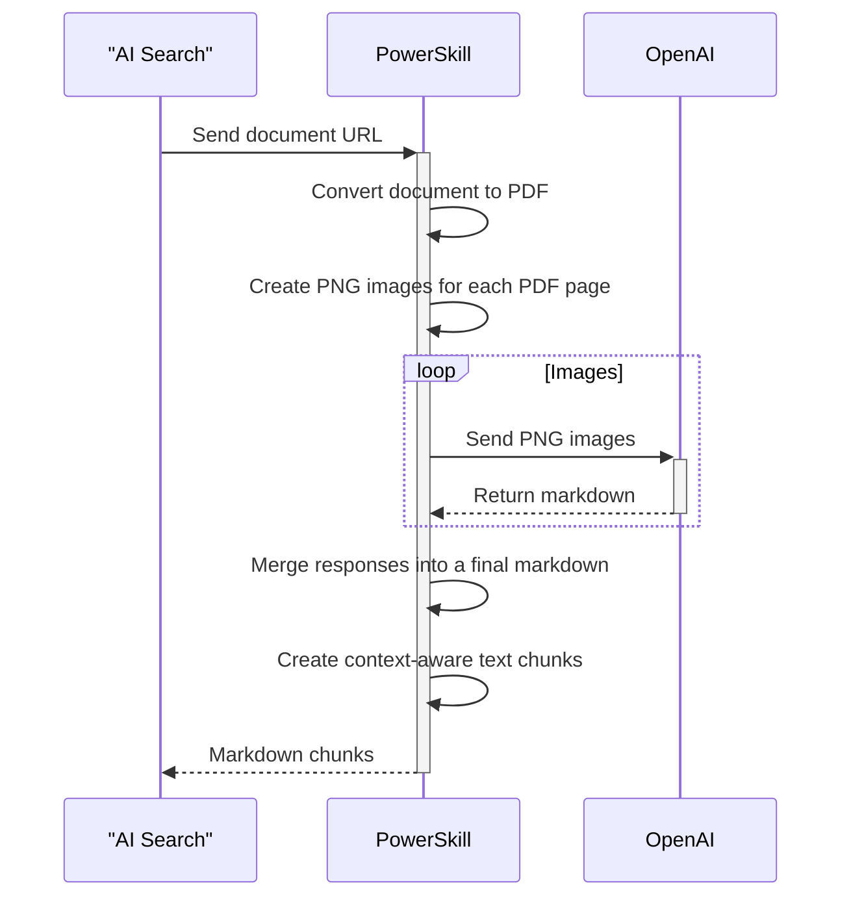

# LLM Chunker Power Skill #

This Power Skill facilitates the conversion of document pages and slides (.pdf, .ppt, .pptx, .doc, .docx) into PNG images, which are then processed by GPT-4o or GPT-4o mini to produce high-quality markdown output.

This skill is ideal for:

- Documents containing visually rich content such as charts, flow diagrams, and decision trees, where conventional OCR/text extraction methods fail to deliver satisfactory results. GPT-4o transcribes all data into text while preserving the original meaning accurately. For instance, a bar chart is converted into a markdown table, and a decision tree graph is transformed into a bullet list that maintains all “Yes/No” decision points and connections between entities. In a standard text extraction pipeline, these connections are often lost, resulting in disjointed words. You can refer to the [Data](data/) folder for examples of documents that are ideal for this solution.

This skill is **NOT** ideal for:
- Documents that primarily contain text or tables, where the goal is to enhance the quality of the AI Search built-in OCR. In such cases, [Azure Document Intelligence](https://azure.microsoft.com/products/ai-services/ai-document-intelligence) is a more suitable alternative due to its faster processing capabilities. There is also [another Power Skill](https://github.com/Azure-Samples/azure-search-power-skills/blob/main/Vision/FormRecognizer) Power Skill available for this purpose.

## Credits
A lot of this code is inpired by the [original solution](https://github.com/liamca/GPT4oContentExtraction) from [Liam Cavanagh](https://github.com/liamca).

## Requirements

In addition to the common requirements described in the root [README.md](https://github.com/Azure-Samples/azure-search-power-skills/blob/master/README.md) 
file, this Power Skill requires access to a OpenAI resource. 

This PowerSkill will use:
* Docker
* Azure Container Registry
* Azure Blob storage container
* Azure Web App Service - Linux Containers
* Azure AI Search instance
* Azure OpenAI

## High level Process



## Quick deployment
In order to deploy everything, you can simply use bash and type
```bash
make deploy
```
and type 'yes' when prompted. You can test your deployment by running the [test scripts](tests/). You need to install Visual Studio Code [REST Client](https://marketplace.visualstudio.com/items?itemName=humao.rest-client) extension.

## Run locally

This section describes how to get the sample working in stages and how it can be amended for your data.
 
1) ### Data
   The first step is to view the sample data files [here](data/). 
1) ### Run with Visual Studio Code
   1) The next step is to run the API locally and test the model against a test record. Make sure you rename the file [.env.example file to .env](../powerskill/.env.example) and populate it with the relevant values.
   1) Run VsCode and connect to your WSL locally. If you do not know what is it, check [here](https://code.visualstudio.com/docs/remote/wsl#_from-vs-code). Open the LLMChunker folder in VsCode (avoid opening the root 'azure-search-power-skills').
   1) Running the app in a Linux distro is required because the document conversion libraries to convert incoming files to PDF requires LibreOffice's Linux libraries. Open your WSL bash terminal in VsCode and then run the command to install it:
      ```bash
      apt-get update
      apt-get -y install libreoffice-nogui
      apt-get -y install wkhtmltopdf
      ```
  1) Create a Python virtual environment and install dependencies:
  ```bash
  python -m venv .venv
  pip install -r powerskill/requirements.txt
  ```  
  1) Press F5 to start debugging in Visual Studio Code.

   You can test your local API by exploring the HTTP request files in [tests](tests/).

## Run in Azure
  In order to deploy this into Azure, we need some to build some shared infrastructure - you may already have this from another PowerSkill. If you do, you can simply rename [base.env.example](base.env.example) to be `base.env` and fill in the values.

  1) ### Deploy shared infrastructure
      If not, you can deploy the foundation simple by running the following in bash
      ```bash
      make deploy-base
      ```
      At this point, Terraform has now created the following infrastructure and created a `base.env` file with the values.
      - Azure Container Registry to store our docker image
      - Azure AI Search
      - Azure OpenAI
      - Azure Blob Storage to hold our data to seach

  1) ### Push the container to Azure Container Registry
      We can now push our container that we built earlier to the cloud. Type the following command in your bash terminal.
      ```bash
      make push-skill
      ```

  1) ### Deploy the container to an Azure Web App.
      We will deploy this as to an [Azure App Service Web App](https://docs.microsoft.com/en-us/azure/app-service/configure-custom-container?pivots=container-linux) running a container. Run the following command:
      ```bash
      make deploy-skill
      ```
      You will be prompted with:
      ```bash
      Do you want to perform these actions?
        Terraform will perform the actions described above.
        Only 'yes' will be accepted to approve.
      ```
      Type 
      ```bash
      yes
      ```
  
### Note about authentication
The application uses [managed identity](https://learn.microsoft.com/en-us/entra/identity/managed-identities-azure-resources/overview) to authenticate itself to storage account and OpenAI. When you deploy this sample to Azure using the provided Terraform scripts, the required permissions and identities are automatically created at the resource group level and are transparent for you.
However, if you are running the application locally, your user needs to have the following permissions:
- Storage account: [Storage Blob Data Reader](https://learn.microsoft.com/en-us/azure/role-based-access-control/built-in-roles/storage#storage-blob-data-reader)
- OpenAI: [Cognitive Services OpenAI User](https://learn.microsoft.com/en-us/azure/role-based-access-control/built-in-roles/ai-machine-learning#cognitive-services-openai-user)

For your convenience, the app returns exactly what user and permissions are needed in case there is an authentication error when acessing these resources.

## Configuration
The available [tests](tests/) scripts only contains the required input parameter *blobUrl*. However, you can also customize the behavior of the extraction process by sending these parameters in each HTTP request:

| Name                          | Description                                                                                                                                                                                                                                                                                                                                                       |
|-------------------------------|-------------------------------------------------------------------------------------------------------------------------------------------------------------------------------------------------------------------------------------------------------------------------------------------------------------------------------------------------------------------|
| image_quality                 | The quality of the images to be sent to OpenAI. The higher the quality, the more tokens it will consume. The available options are: low, high_720p, high_1024p, high_1920p. If your source documents have small text, increase this value until you get satisfactory results. For more details, refer to OpenAI Vision Guide. Default value = 'high_1024p' |
| chunk_size                    | The size (in tokens) to split the markdown sections in case they go over this value. If a markdown section of heading 3 (###) goes over this value, it will be split into multiple chunks. If the markdown section is below that token size, it will be returned as a single chunk. Default value = 512                                                                                   |
| chunk_overlap                 | The percentage of overlap between chunks. This parameter is used to avoid splitting sentences between chunks. Default value = 25   
| extraction_prompt                 | The prompt used in OpenAI to perform the conversion from images to markdown. Default value can be checked [here](powerskill/models/app_config.py) |                                                                                                                                                                              
More settings are set in the application-level environment settings:

| Name                          | Description                                                                                                                                                                                                                                                                                                                                                       |
|-------------------------------|-------------------------------------------------------------------------------------------------------------------------------------------------------------------------------------------------------------------------------------------------------------------------------------------------------------------------------------------------------------------|
| openai_deployment             | The deployment name of the OpenAI instance. Eg: gpt4o-deployment                                                                                                                                                                                                                                                                                                  |
| openai_api_version            | The API version of Azure OpenAI according to Azure OpenAI Reference. Default value = 2024-06-01                                                                                                                                                                                                                             |
| openai_max_concurrent_requests| The maximum number of concurrent requests to make to the OpenAI at a given time. Increase or decrease this based on your available quota. Devault value = 5                                                                                                                                                                                                                         |
| openai_max_images_per_request | The maximum number of images (document pages) to send to OpenAI in a single request. This parameter is highly dependent on the size of the images (which is set by the 'IMAGE_QUALITY' parameter). The more images in the request, the better context OpenAI has to generate coherent markdown output, but it also increases response time and token consumption. Default value = 15 |
| openai_max_retries            | The maximum number of retries to make to the OpenAI API in case of rate limiting responses (HTTP status code 429). Default value = 6                                                                                                                                                                                                                                                |
| openai_max_backoff            | The maximum number of seconds to wait before retrying a request to the OpenAI API in case of rate limiting responses (HTTP status code 429). Default value = 60                                                                                                                                                                                                                       |
| openai_max_tokens_response    | The maximum number of tokens to expect in the OpenAI response per image. If your parameter 'openai_max_images_per_request' is set to 15 and 'openai_max_tokens_response' is set to 1024, that means your total max_tokens in the response will be 15 * 1024 = 15360. Do not set this value above 16000, which is GPT4o/mini max tokens response. Default value = 1024 |       